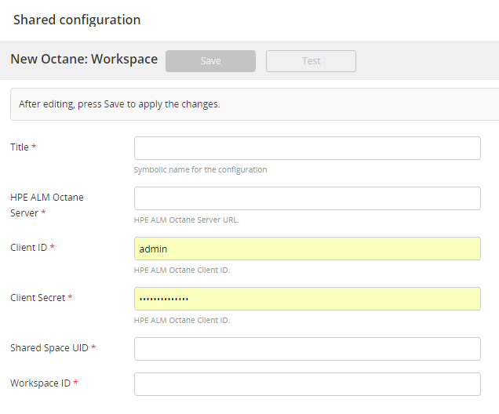
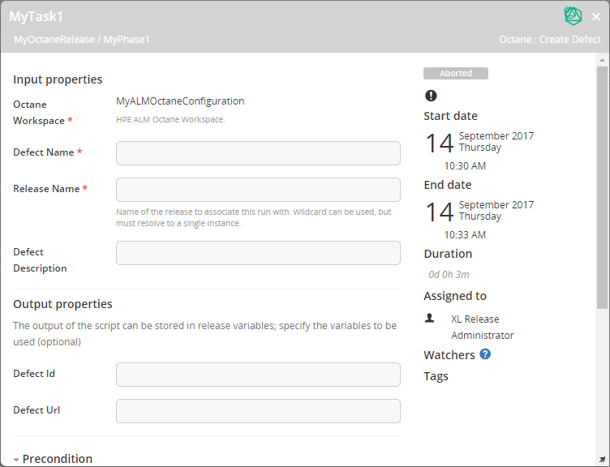
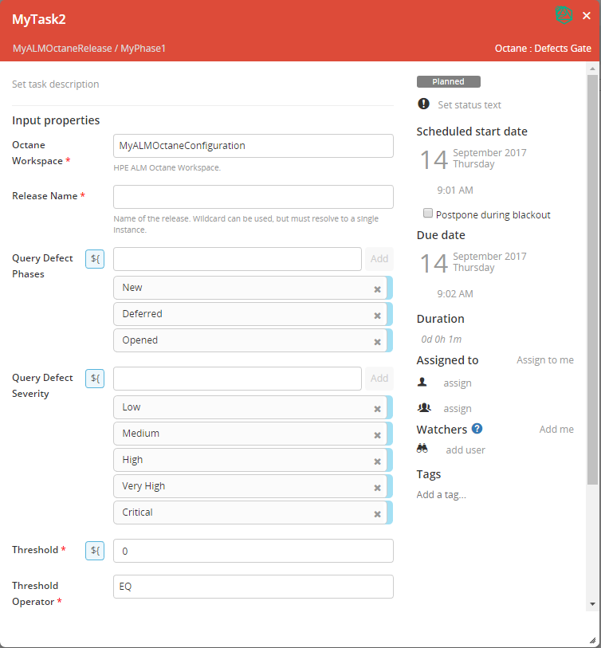

# Using the XL Release ALM Octane plugin

The XL Release ALM Octane plugin enables XL Release tasks to interact with an [ALM Octane](https://software.microfocus.com/en-us/software/alm-octane) server.

## Features

Using the ALM Octane plugin for XL Release, you can perform the following tasks to interact with an ALM Octane server:

*   [ALM Octane: Create Defect](#Add)

*   [ALM Octane: Gate](#Query)

## Prerequisites

In ALM Octane, define API access with the team member role for the plugin. Save the client ID and client secret for use when connecting to an ALM Octane server in XL Release.

## Set up and connect to an ALM Octane server

To set up and connect to an ALM Octane server:

1.  In XL Release, go to **Settings > Shared configuration** and click **Add Workspace** under ALM Octane.

2.  In the **Title** box, enter any name for the ALM Octane configuration.

3.  In the **Server** box, enter the URL for the ALM Octane server, including the IP address and the port.

4.  In the **Client ID** and **Client Secret** boxes, enter the ALM Octane client ID and secret.

5.  In the **Space ID** and **Workspace ID** boxes, enter the ALM Octane corresponding IDs.

6.  Click **Save** to save the customization.

## **ALM Octane: Create Defect**

The **ALM Octane: Create Defect** task type creates defects in ALM Octane.

The plugin creates the defects: 

*   In the root of the ALM Octane backlog tree.

*   As drafts. This means that when opening up these defects in ALM Octane, you must enter values for mandatory fields.

*   With an origin of **XL Release**, so the source of the defect is clear.

The following properties are available:

*   **Workspace**: The workspace in which to create the defect, based on the connected shared configuration. Mandatory.

*   **Defect Name**: The defect name. Mandatory.

*   **Release Name**: The ALM Octane release. Mandatory.

*   **Defect Description**: The defect description.

The output of the task includes: 

*   **Defect ID**.  You can enter the name of a variable in which to store the ID of the ALM Octane defect being created.

*   **Defect URL**. You can enter the name of a variable in which to store the URL for accessing the defect in ALM Octane.

## ALM Octane: Gate

The **ALM Octane: Gate** task type executes a query on an ALM Octane server to retrieve a list of defects and their names.

The following properties are available:

*   **Workspace**: The workspace in which to create the defect, based on the connected shared configuration. Mandatory.

*   **Release Name**: The ALM Octane release. Mandatory.

*   **Query Defect Phases**: A query that finds the defects that have the selected phases.

*   **Query Defect Severity**: A query that finds the defects that have the selected severity.

*   **Threshold**: A number that represents the number of defects that can be tolerated for subsequent tasks to run.

*   **Threshold Operator**: The operator that defines if the number of defects is acceptable compared to the **Threshold**.

The output of the task is:

*   A list of defects displayed in ALM Octane.

## Sample scenario

You can create an **ALM Octane: Create Defect** task that creates a defect if a preconditon indicates that there are defects of high severity.

You can create an **ALM Octane: Gate** task that will not let any subsequent tasks run if a high severity defect was opened.
